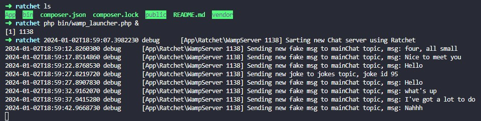
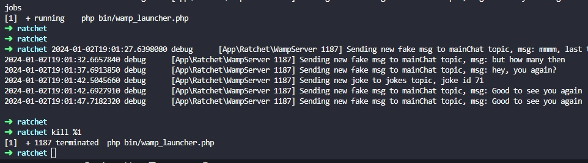
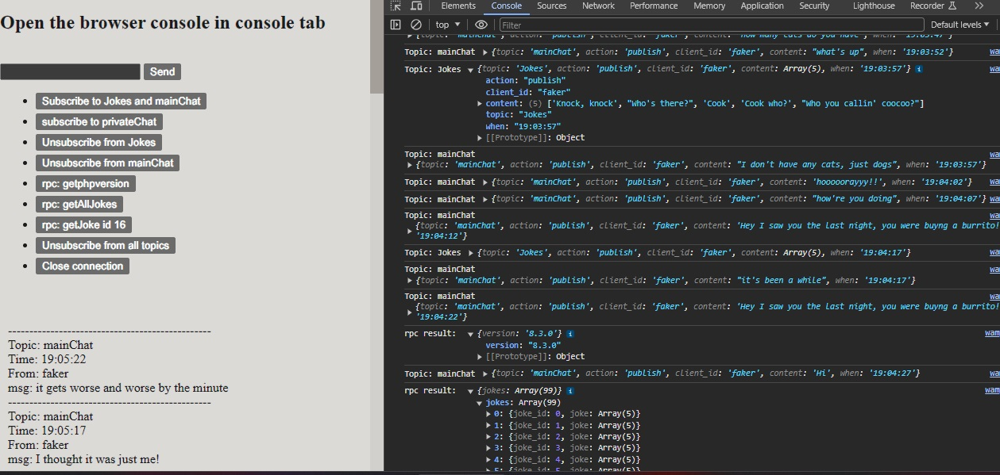

# Ratchet Demo

##### this demo contains 2 demos:

demo 1: a chat demo using a simple websocket server
demo 2: a chat demo using a wamp server (this is wamp v1)

For the demo 1 there is no need for a special library as the native js functions are sufficient to handle connection and events.

For the demo 2, since the intended clients are browser clients I will be using a js client, in this case it is autobahn v 0.8.2


## Disclaimer:
Currently (December 2023) autobahn-js version is 22.11.1 and it is intended to work with the WAMP V2 protocol.

Ratchet is considered old software, and there are other alternatives to implement websockets using PHP.

[check this question in stackoverflow](https://stackoverflow.com/questions/68433313/autobahn-js-failes-to-connect-to-ratchet-server-wamp)

If you want to implement a newer alternative to php websockets I would recommend to take a look at laravel or voryx/thruway. (I've got a thruway implementation demo if you are interested)

That being said, I built this demo as an exercise in order to understand the basics of Ratchet, and I hope it helps anyone to get things going.

---

## Installation:

just make a clone of this repo:
```
git clone url.git
```

## running the examples

In your CLI go to the project directory where you cloned this repo

To run the Chat server:
```
php bin/chat_launcher.php &
```

To run the wamp server:
```
php bin/wamp_launcher.php &
```

Using ampersand at the end of the command will execute the server in detached mode, freeing your CLI.

To stop your server do:
```
jobs
```

The number in square brackets is the job_id, to kill the job do:
```
kill % job_id
```

## this example uses fake data to produce trafic in two topics: "Jokes" and "mainChat"

## some screen caps (wamp example):

### starting the server


### stopping the server


### browser activity


### useful summary:

#### Ratchet\Wamp\Topic class

##### Properties
1. private id (topic name)
2. private subscribers (SplObjectStorage for connections)

##### Methods
1. getId(): string
2. broadcast($msg, array $exclude = array(), array $eligible = array()): Topic
3. has(ConnectionInterface $conn): boolean
4. add(ConnectionInterface $conn): Topic
5. remove(ConnectionInterface $conn): Topic
6. getIterator(): null|subscribers
7. count(): int

#### React\EventLoop\Loop class

##### Properties
1. private instance (LoopInterface)
2. private stopped (bool)

##### Methods (more info in React\EventLoop\LoopInterface)
1. get(): LoopInterface
2. set(): void
3. addReadStream(resource $stream, callable $listener): void
4. addWriteStream(resource $stream, callable $listener): void
5. removeReadStream(resource $stream): void
6. removeWriteStream(resource $stream): void
7. addTimer(float $interval, callable $callback): TimerInterface
8. addPeriodicTimer(float $interval, callable $callback): TimerInterface
9. cancelTimer(TimerInterface $timer): void
10. futureTick(callable $listener): void
11. addSignal(int $signal, callable $listener): void
12. removeSignal(int $signal, callable $listener): void
13. run(): void
14. stop(): void

##### loop demos
```
$loop->addReadStream($stream, function ($stream) use ($name) {
    echo $name . ' said: ' . fread($stream);
});

$loop->addWriteStream($stream, function ($stream) use ($name) {
    fwrite($stream, 'Hello ' . $name);
});


$loop->addTimer(0.8, function () {
    echo 'world!' . PHP_EOL;
});

$loop->addTimer(0.3, function () {
    echo 'hello ';
});

function hello($name, LoopInterface $loop){
    $loop->addTimer(1.0, function () use ($name) {
        echo "hello $name\n";
    });
}

hello('Tester', $loop);


$timer = $loop->addPeriodicTimer(0.1, function () {
    echo 'tick!' . PHP_EOL;
});

$loop->addTimer(1.0, function () use ($loop, $timer) {
    $loop->cancelTimer($timer);
    echo 'Done' . PHP_EOL;
});

function hello($name, LoopInterface $loop)
{
    $n = 3;
    $loop->addPeriodicTimer(1.0, function ($timer) use ($name, $loop, &$n) {
        if ($n > 0) {
            --$n;
            echo "hello $name\n";
        } else {
            $loop->cancelTimer($timer);
        }
    });
}
hello('Tester', $loop);

$name = "FancyName";

function hello($name, LoopInterface $loop)
{
    $loop->futureTick(function () use ($name) {
        echo "hello $name\n";
    });
}

hello('Tester', $loop);

$loop->futureTick(function () {
    echo 'b';
});
$loop->futureTick(function () {
    echo 'c';
});
echo 'a';

$loop->addSignal(SIGINT, function (int $signal) {
    echo 'Caught user interrupt signal' . PHP_EOL;
});

$loop->removeSignal(SIGINT, $listener);

$loop->run();

$loop->addTimer(3.0, function () use ($loop) {
    $loop->stop();
});
```

#### React\Socket\ConnectionInterface implemented in React\Socket\Connection

##### Methods (for more info see React\Socket\ConnectionInterface)

1. getRemoteAddress(): string
2. getLocalAddress(): string

##### demos

```
$address = $connection->getRemoteAddress();
echo 'Connection with ' . $address . PHP_EOL;

// $address will output `tcp://127.0.0.1:8080`, `tcp://[::1]:80`, `tls://127.0.0.1:443`

$address = $connection->getLocalAddress();
$ip = trim(parse_url($address, PHP_URL_HOST), '[]');
echo 'Connection with ' . $ip . PHP_EOL;
```
